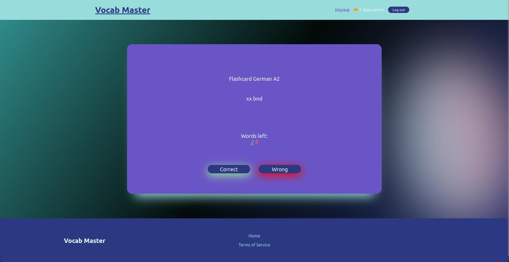

# Vocab master
full stackk website for learning vocabulary in foreign languages using flashcards<br>
created with 




## Features
- flashcards
- saving user progress
- login
- register
- full mysql integration
- log out
- cookies
## Usage
To run frontend
```
npm run
```
in new terminal, run backend
```
cd server/
npm run
```
## Installation
```
npm build
```
